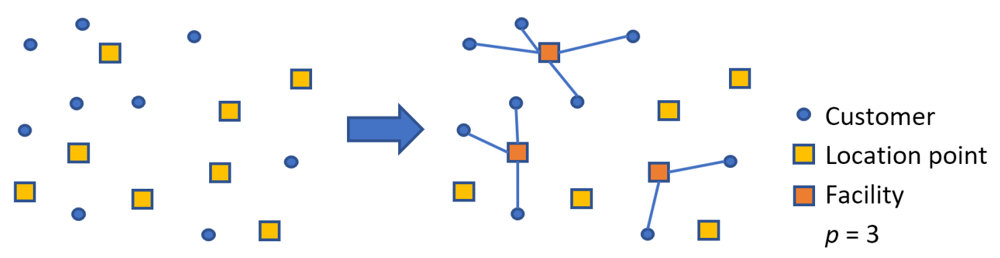

# p-Facility Location API



The main objective is to efficiently locate a given number `p` of logistics facilities. This is done by minimizing the total proximity (or total travel distance, or total travel time) between the located facilities and clients, respecting possible minimum or maximum demand restrictions and the exclusive service regions.


The `p`-facility location problem was modeled using Integer Programming (IP). For the IP modeling, I turned to [Pyomo](https://www.pyomo.org/) and the [HiGHS](https://github.com/ERGO-Code/HiGHS) solver, known for its high performance.

## **Integer programming model**

   

## `POST v1/locate`

The REST API, developed with [FastAPI](https://github.com/tiangolo/fastapi), provide an endpoint to solve the problem:

> https://facility-location-api.onrender.com/v1/locate


Three **`cost_type`** can be minimized:

1. **Proximity** (`"cost_type": 'proximity'`): the proximity between facilities and clients will be minimized, proximity will be calculated using the spherical distance between them.
2. **Travel distances** (`"cost_type": 'distances'`): the street travel distances using a car between logistics facilities and clients will be minimized. The _Open Source Routing Machine (OSRM)_ server will be queried to obtain travel distances between logistics facilities and clients.
3. **Travel durations** (`"cost_type": 'durations'`): the street travel durations using a car between logistics facilities and clients will be minimized. The _Open Source Routing Machine (OSRM)_ server will be queried to obtain travel durations between logistics facilities and clients.
    

By default the objective will be to minimize proximity. The other cost types are time consuming as they depend on the availability of open resources of the OSRM service.

The request body must have the following format:

``` json
{
   "cost_type [optional]":"<'proximity', 'distances', 'durations'>",
   "number_new_facilities":"<positive integer>",
   "fixed_facilities [optional]":[
      {
         "id":"<string for facility id>",
         "name":"<string for facility name>",
         "location": {
            "lat":"<float for location latitude coordinate>",
            "lng":"<float for location longitude coordinate>"
         },
         "demand": {
            "minimum [optional]":"<non negative float for facility minimum demand>",
            "maximum [optional]":"<non negative float for facility maximum demand>"
         },
         "exclusive_region [optional]":"<Geojson of polygons/multipolygons for facility exclusive service region>"
      },
      ...
   ],
   "number_client_clusters [optional]": "<positive integer>",
   "clients":[
      {
         "id":"<string for client id>",
         "location": {
            "lat":"<float for location latitude coordinate>",
            "lng":"<float for location longitude coordinate>"
         },
         "demand":"<positive float for the client demand> [optional]"
      },
      ...
   ]
}

 ```

The response body has the following format:

``` json
{
  "status": "<'infeasible', 'feasible', 'optimal'>",
  "message": "<message from the solver>",
  "total_costs": "<non negative float for the objective value in the returned solution>",
  "(located) facilities": [
    {
      "id":"<string for facility id>",
      "name":"<string for facility name>",
      "location": {
         "lat":"<float for location latitude coordinate>",
         "lng":"<float for location longitude coordinate>"
      },
      "demand": {
         "minimum [optional]":"<non negative float for facility minimum demand>",
         "expected": "<non-negative float for expected demand met by the located facility>",
         "maximum [optional]":"<non negative float for facility maximum demand>"
      },
      "exclusive_region [optional]":"<Geojson of polygons/multipolygons for facility exclusive service region>"
   },
    ...
  ]
}

 ```

## Postman 
* [Documentation]()

## GitHub
* [Repository](https://github.com/luanleonardo/facility-location-api)
